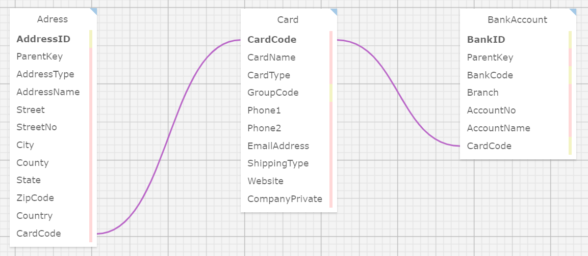

## Diagrama Entidade-Relacionamento (ER) do Projeto de Implementação SAP

&emsp;&emsp; O diagrama presente na figura abaixo foi criado com base nos dados mestres usados pelo grupo [G2²](https://github.com/Inteli-College/2024-2A-T10-SI07-G02/tree/main/src/data), que incluem informações sobre clientes, fornecedores, endereços e contas bancárias. O objetivo do diagrama é ilustrar como os dados estão organizados e as relações entre as principais entidades envolvidas.

Figura 1 - Diagrama Entidade Relacionamento

Fonte: Material produzido pela autora (2024)

## Entidades Principais

### 1. **Card**
   - **Descrição**: A entidade `Card` representa as entidades do sistema que podem ser clientes ou fornecedores, conforme indicado no campo `CardType`. Esta tabela contém informações básicas sobre cada entidade, como nome, tipo de entidade, contatos e outros detalhes.
   - **Atributos**:
     - `CardCode` (PK): Código único que identifica o cliente ou fornecedor.
     - `CardName`: Nome da entidade.
     - `CardType`: Define se a entidade é um cliente, fornecedor ou outro tipo.
     - `GroupCode`: Grupo ao qual a entidade pertence (por exemplo, grupo de fornecedores, grupo de clientes).
     - `Phone1`, `Phone2`: Telefones de contato.
     - `EmailAddress`: E-mail da entidade.
     - `ShippingType`: Tipo de envio preferido pela entidade.
     - `Website`: Endereço do site da entidade.
     - `CompanyPrivate`: Indica se é uma empresa privada.
   - **Fonte de Dados**: Esta entidade foi mapeada a partir do arquivo `processed_cadastros_PN.xlsx`, que contém os registros de clientes e fornecedores.

### 2. **Address**
   - **Descrição**: A entidade `Address` armazena os endereços relacionados aos clientes e fornecedores cadastrados no sistema. Cada entidade (cliente ou fornecedor) pode ter múltiplos endereços, como endereços de cobrança ou envio.
   - **Atributos**:
     - `ParentKey` (FK - CardCode): Referência ao código da entidade (cliente ou fornecedor) na tabela `Card`.
     - `AddressType`: Tipo de endereço (por exemplo, cobrança, envio).
     - `AddressName`: Nome associado ao endereço.
     - `Street`: Nome da rua.
     - `StreetNo`: Número da rua.
     - `City`, `County`: Cidade e região onde o endereço está localizado.
     - `State`: Estado onde o endereço está localizado.
     - `ZipCode`: Código postal.
     - `Country`: País onde o endereço está localizado.
   - **Fonte de Dados**: Os dados desta entidade foram extraídos do arquivo `processed_CRD1.xlsx`, que contém registros de endereços associados a cada cliente ou fornecedor.

### 3. **BankAccount**
   - **Descrição**: A entidade `BankAccount` contém as informações bancárias associadas a clientes e fornecedores. Cada entidade pode ter várias contas bancárias registradas.
   - **Atributos**:
     - `ParentKey` (FK - CardCode): Referência ao código da entidade (cliente ou fornecedor) na tabela `Card`.
     - `BankCode`: Código do banco.
     - `Branch`: Agência bancária.
     - `AccountNo`: Número da conta bancária.
     - `AccountName`: Nome associado à conta bancária.
   - **Fonte de Dados**: Os dados desta entidade foram obtidos a partir do arquivo `processed_CRD7.xlsx`, que contém as contas bancárias associadas a clientes e fornecedores.

## Relacionamentos

### 1. **Relacionamento entre `Card` e `Address`** (1:N)
   - **Descrição**: Um cliente ou fornecedor (`Card`) pode ter múltiplos endereços (`Address`). Por exemplo, uma empresa pode ter endereços de faturamento e endereços de entrega, ambos associados à mesma entidade.
   - **Implementação**: A chave estrangeira `ParentKey` na entidade `Address` referencia a chave primária `CardCode` da entidade `Card`, indicando a relação de um para muitos (1:N) entre clientes/fornecedores e seus endereços.

### 2. **Relacionamento entre `Card` e `BankAccount`** (1:N)
   - **Descrição**: Um cliente ou fornecedor (`Card`) pode ter várias contas bancárias registradas no sistema (`BankAccount`). Isso é útil para armazenar informações bancárias de múltiplos bancos para a mesma entidade.
   - **Implementação**: A chave estrangeira `ParentKey` na entidade `BankAccount` referencia a chave primária `CardCode` da entidade `Card`, representando a relação de um para muitos (1:N) entre clientes/fornecedores e suas contas bancárias.

Este diagrama ER reflete a organização dos dados mestres essenciais para a implementação do SAP na G2 Tecnologia. Ele estabelece a relação entre as entidades de clientes e fornecedores e seus respectivos endereços e dados bancários. Esse modelo pode ser expandido para incluir outras entidades ou relações, dependendo das necessidades futuras do projeto.